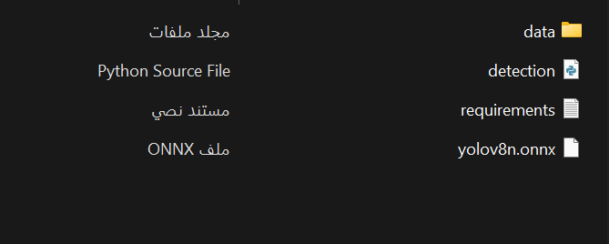

# 🎓 Graduation Project - The Vision of Blind People

This is my graduation project titled **"The Vision of Blind People"**.  
I was the team leader and responsible for managing and developing the core functionalities of the system.

<p align="center">
  
</p>

---

## 📌 Project Idea

This project aims to assist visually impaired individuals by enabling them to detect nearby objects through a real-time camera feed and receive audio feedback about the object's name and location (left, center, or right).

By combining YOLOv8 object detection with text-to-speech (TTS) technology, the system acts like a "talking assistant" that can describe the surroundings aloud — helping users navigate the environment more safely and independently.


---

## 🛠️ Tools & Technologies

| Component        | Description                                                                 |
|------------------|-----------------------------------------------------------------------------|
| Raspberry Pi 4   | The processing unit that runs the detection and audio system                |
| Web Cam          | Input device that captures real-time video                                  |
| Earphone         | Output device that provides audio feedback to the user                      |
| YOLOv8 (ONNX)    | The object detection model used for identifying and locating objects        |
| Python + OpenCV  | The main programming language and computer vision library used in the code |
| pyttsx3          | Text-to-Speech library used to speak out detected objects                   |

<p align="center">
  
  
  
</p>

---

## ⚙️ How it Works ??

1. **The camera captures real-time video**  
   A webcam is connected to the system to continuously stream live video.  
   Each frame is captured and sent to the object detection model for analysis.  
   This allows the system to observe the environment in real time.

2. **YOLO model detects objects**  
   The captured frame is processed using a YOLOv8 model in ONNX format.  
   The model analyzes the image and identifies known objects with bounding boxes.  
   It also calculates the position of each object (left, center, right) relative to the frame.

3. **The system announces the object using audio**  
   Once an object is detected, the system uses a text-to-speech engine to say its name and position.  
   For example, it might say: "Cup center" or "Chair right."  
   This voice feedback helps blind users understand what's around them.

---

## 🧩 Installation

Open your terminal and install the following:

```

pip install opencv-python pyttsx3 numpy
pip install onnxruntime
```
---

After that, download or place the required YOLO files (model + labels) in the same folder as the code.  
These are located in the folder named `yolov8-python`.

<p align="center">
  
</p>

---

## ▶️ How to Run

Open CMD in the project folder and run:

```bash
python code.py --source 0 --names class.names --model yolov8n.onnx
```

⚠️ Make sure all the files (code.py, class.names, and yolov8n.onnx) are in the same folder.


---
Once you run the code, a window will open showing the camera feed, and the system will begin detecting and speaking object names and positions.

<p align="center">  </p>

